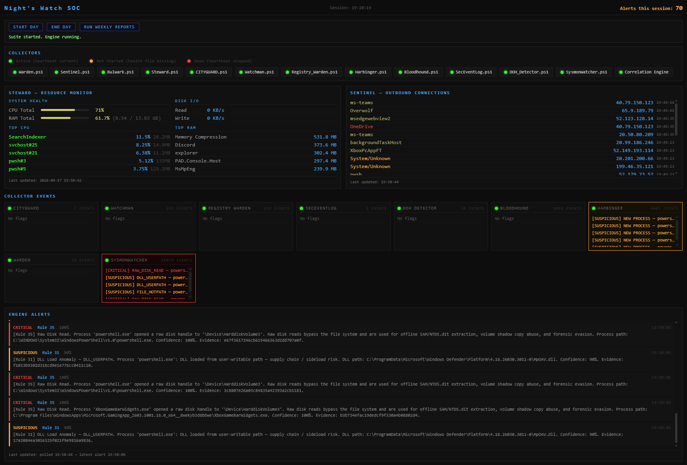
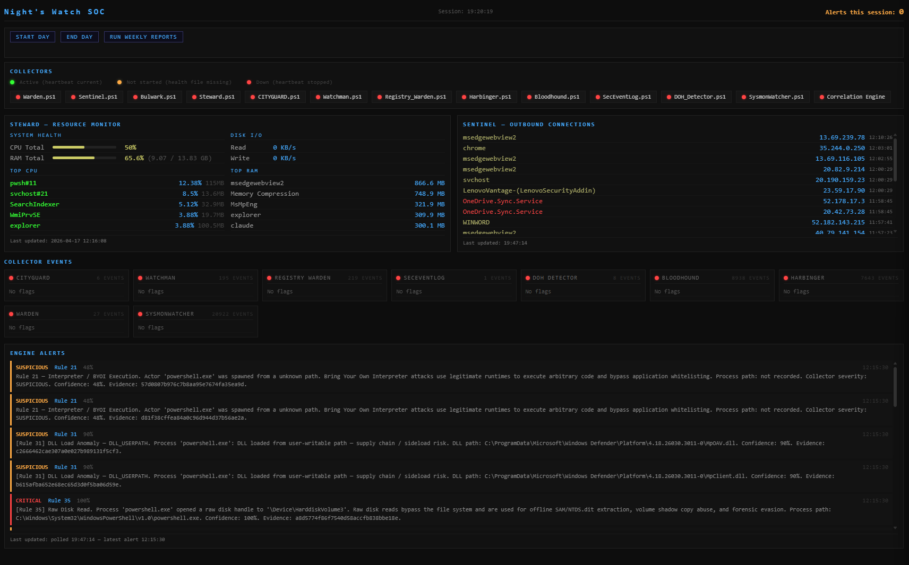
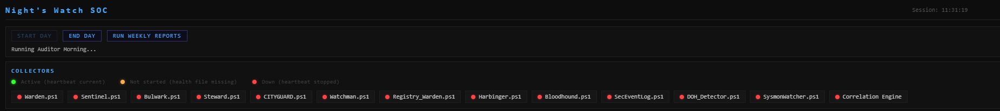
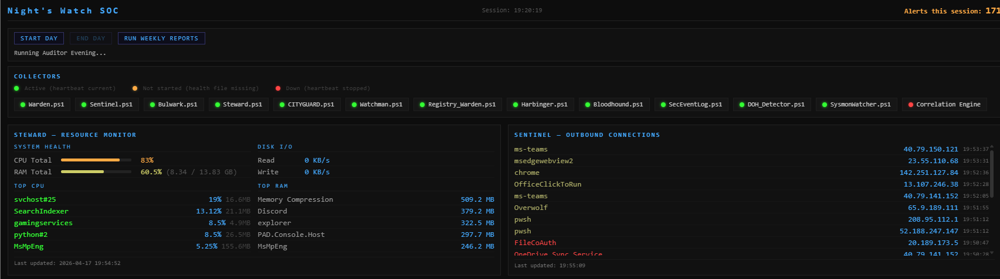
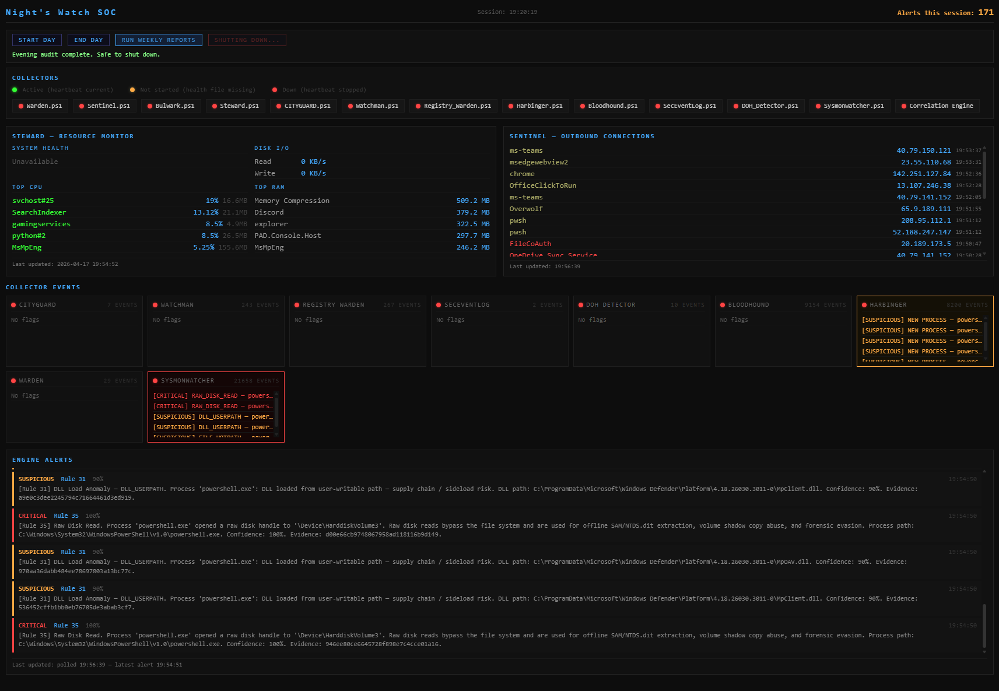
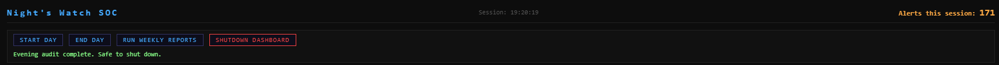
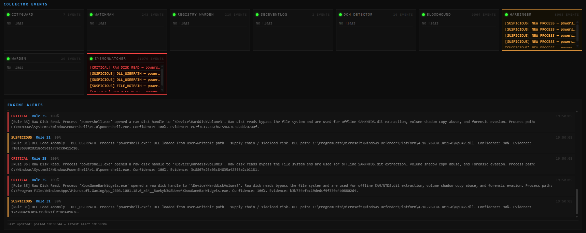

# Home SOC Suite — Night's Watch

A personal Security Operations Center (SOC) built from scratch during an
Anwendungsentwicklung retraining program. This suite monitors a Windows endpoint
for network anomalies, resource spikes, process execution, registry changes,
Security Event Log activity, scheduled task changes, DNS queries, and power events
— logging everything to structured files for weekly analysis and correlation
through a Python engine.



*Single-page Flask dashboard. All 12 collectors + correlation engine active,
live resource monitor, outbound connection feed, collector event tiles, and
streaming engine alerts.*

---

## Background

Built as a practical learning project alongside formal IT retraining, this suite
applies real SOC concepts — baseline collection, anomaly detection, severity
classification, log aggregation, and cross-source correlation — to a personal
Windows machine. The design process was adversarial from the start: each phase
was stress-tested against a red team analysis before the next was built, with
48 correlation rules defined from those findings driving the architecture of the
Python engine.

---

## Roadmap

Development is tracked in [`roadmap.md`](roadmap.md) — current state, Phase 9
Forensic Engine plans, and longer-term hardening goals.

---

## Dashboard Setup

The dashboard runs as a Flask server and requires Administrator elevation for
collector process detection. Create a shortcut once after cloning:

1. Right-click the Desktop → New → Shortcut
2. Set the location to:
   ```
   pwsh.exe -ExecutionPolicy Bypass -WindowStyle Minimized -File "C:\path\to\SOC\Dashboard\Launch_Dashboard.ps1"
   ```
   Replace `C:\path\to\SOC` with your actual install path.
3. Name it: `SOC Dashboard`
4. Right-click the shortcut → Properties → Advanced → check **Run as administrator**
5. Click OK

The shortcut starts Flask, waits for it to be ready, then opens the browser
automatically. If Flask is already running it skips startup and opens the
browser directly. Status dots will show grey if the shortcut is run without
Administrator elevation.

---

## Dashboard Lifecycle

The dashboard enforces a clean start/stop sequence so the Auditor bookends
(morning integrity check, evening hash chain validation) always run in order.

### 1. Pre-start — Suite Not Started



All collector heartbeats are red (health files missing or stopped). The
Shutdown Dashboard button is hidden — the dashboard will not allow shutdown
until End Day has run.

### 2. Start Day — Suite Running



Start Day runs the morning Auditor bookend (SHA256 log verification, archive
hash chain validation) and launches all 12 collectors plus the correlation
engine. Heartbeats turn green as each collector reports in.

### 3. End Day — Running Evening Auditor



End Day stops all collectors in sequence and runs the evening Auditor bookend.
Collector dots stay green while the sequence runs; the status line shows
*Running Auditor Evening…*

### 4. Post-shutdown — Safe to Close



Once the evening audit completes, all collector dots go red, the status line
reads *Evening audit complete. Safe to shut down.*, and the **Shutdown
Dashboard** button appears — clicking it terminates the Flask process cleanly.



The browser tab must be closed manually (browsers do not expose a close API to
external processes).

---

## Live Alerts

Collector event tiles show the most recent severity-tagged events per source.
The Engine Alerts feed streams correlated findings from the Python engine in
real time, with rule number, confidence score, full evidence chain, and SHA256
evidence hash.



*Example: Rule 35 (Raw Disk Read) firing on `powershell.exe` opening a raw
handle to `\Device\HarddiskVolume3`, and Rule 31 (DLL Load Anomaly) flagging
Defender DLLs loading from a user-writable path. Both with full process
provenance and file hashes.*

---

## Architecture

The suite follows a three-layer architecture:

**Collection Layer** — PowerShell collectors that run continuously in the
background, each monitoring a specific data source and writing structured,
severity-tagged log entries. All require Administrator elevation.

**Analysis Layer** — PowerShell analyst scripts that parse collected logs and
generate weekly summary reports. Run as standard user.

**Correlation Engine (Phase 7 — complete)** — Python engine that ingests all
collector logs, normalises events to a common schema, and runs rule-based and
risk-scored correlation across all data streams. Three programs:

| Program | Phase | Role |
|---|---|---|
| Correlation Engine | 7 — complete | Ingest, normalise, correlate, alert (SQLite operational store) |
| SOC Dashboard | 8 — complete | Live visibility — collector health, alerts, evidence chains (Flask) |
| Forensic Engine | 9 — planned | Post-event investigation — super timelines, process lineage, beacon analysis, persistence audits, append-only evidence databank |
| Forensic Dashboard | 9 — planned | Summarised forensic conclusions — color-coded status, report generation, evidence navigation |

---

## Scripts

### Collectors

| Phase | Script | Nickname | Function |
|---|---|---|---|
| 1 | Sentinel.ps1 | Network Watchdog | Outbound TCP connections with geolocation, process path verification, and cumulative transfer tracking |
| 1 | Bulwark.ps1 | Night's Watch | Inbound listening ports — baseline diff, new/closed port detection, geolocation anomalies |
| 1 | Steward.ps1 | Quartermaster | CPU, RAM, and disk I/O per process using Windows performance counters with 8-language auto-detection |
| 1 | CityGuard.ps1 | City Guard | Scheduled task additions, deletions, and modifications — action and trigger change detection |
| 1 | Watchman.ps1 | Watchman | Power events — boot, sleep, wake, unexpected shutdown, and after-hours activity |
| 2A | Registry_Warden.ps1 | — | Registry run keys, RunOnce, Services baseline and diff, SAM RID integrity check |
| 2B | Harbinger.ps1 | — | WMI/CIM event-driven process creation monitor — high-risk path detection, parent process tracking |
| 3 | Bloodhound.ps1 | — | DNS query monitor — DGA detection via Shannon entropy, TXT record flagging, ICMP volume spike detection |
| 4 | Warden.ps1 | — | Suite watchdog — SHA256 script FIM, log size regression, collector health, maintenance flag, self-watch scheduled task |
| 5 | SecEventLog.ps1 | — | Windows Security Event Log — logon anomalies, account manipulation, privilege escalation, service installation, brute force detection |
| 6 | DoH_Detector.ps1 | — | DNS-over-HTTPS evasion detector — TCP connections to 28 known DoH resolver IPs from non-whitelisted processes |
| 7 | SysmonWatcher.ps1 | — | Sysmon kernel-level event monitor — process injection, LSASS access, raw disk reads, unsigned driver loads, WMI persistence, and browser debugger attachment (22 event IDs) |

### Analysts

| Script | Nickname | Function |
|---|---|---|
| Investigator.ps1 | Audit Reporter | Weekly analysis of Sentinel outbound connection logs |
| Crow.ps1 | Lord Commander | Weekly analysis of Bulwark inbound port logs |
| Ledger.ps1 | Maester | Weekly analysis of Steward resource logs with RAM trend detection |
| Castellan.ps1 | Castellan | Weekly analysis of CityGuard scheduled task logs |
| Auditor.ps1 | — | Morning/evening bookend integrity audit — SHA256 log verification, archive hash chain validation |

---

## Correlation Rules

Defined through multi-round red team analysis (see Documentation). Implemented in Phase 7.

| # | Rule | Severity | Sources |
|---|---|---|---|
| 1 | Data Exfiltration Suspected | HIGH | Steward + Sentinel |
| 2 | C2 Beacon Suspected | HIGH | Sentinel + Bulwark |
| 3 | Persistence + C2 Callback | CRITICAL | CityGuard + Sentinel |
| 4 | After Hours Intrusion | CRITICAL | Watchman + Sentinel |
| 5 | Data Staging | HIGH | Bulwark + Steward |
| 6 | LOLBin Network Activity | CRITICAL | Sentinel |
| 7 | Process Hollowing Suspected | CRITICAL | Harbinger + Sentinel |
| 8 | DoH Evasion Suspected | CRITICAL | DoH_Detector |
| 9 | WMI Persistence Suspected | HIGH | Harbinger + CityGuard |
| 10 | Account Manipulation | CRITICAL | SecEventLog |
| 11 | Burst Exfiltration Pattern | HIGH | Sentinel |
| 12 | Sub-Threshold Persistent Process | SUSPICIOUS | Sentinel + Steward |
| 13 | Initial Access Suspected | CRITICAL | Harbinger + Sentinel |
| 14 | Trusted Binary Anomaly | SUSP→CRIT | Sentinel |
| 15 | Statistical Jitter Detector | HIGH | Sentinel |
| 16 | Contextual Integrity Violation | CRITICAL | Harbinger + Sentinel |
| 17 | Identity / RID Hijack | CRITICAL | Registry_Warden + SecEventLog |
| 18 | Correlation Engine Health | MEDIUM | Python Core |
| 19 | Self-Protection / Script FIM | CRITICAL | Warden |
| 20 | Statistical Temporal Drift | MEDIUM | Steward + Sentinel |
| 21 | Interpreter Lockdown / BYOI | HIGH | Harbinger |
| 22 | Cloud API Anomaly | HIGH | Sentinel |
| 23 | HID Injection Detector | CRITICAL | WMI Device Events |
| 24 | Evil Twin / WiFi Ghost | CRITICAL | Network Monitor |
| 25 | Focus Thief / Window Hijack | HIGH | Win32 API |
| 26 | Visit Integrity Check | HIGH | All collectors |
| 27 | Delayed Initial Access | CRITICAL | Harbinger + Sentinel (SQLite watchlist) |
| 28 | Browser Debugger Attachment | CRITICAL | SysmonWatcher (Event ID 10) |
| 29 | Kernel Process Injection | CRITICAL | SysmonWatcher (Event ID 8) |
| 30 | Unsigned Driver Load | CRITICAL | SysmonWatcher (Event ID 6) |
| 31 | Suspicious Image Load | SUSPICIOUS | SysmonWatcher (Event ID 7) |
| 32 | WMI Subscription Binding | CRITICAL | SysmonWatcher (Event IDs 19/20/21) |
| 33 | LSASS Access Suspected | CRITICAL | SysmonWatcher (Event ID 10) |
| 34 | Raw Disk Read | CRITICAL | SysmonWatcher (Event ID 9) |
| 35 | Executable File Created | SUSPICIOUS | SysmonWatcher (Event ID 11) |
| 36 | AMSI Provider Tampered | CRITICAL | SysmonWatcher (Event ID 12) |
| 37 | Named Pipe Suspicious | SUSPICIOUS | SysmonWatcher (Event IDs 17/18) |
| 38 | Downloaded Executable | HIGH | SysmonWatcher (Event ID 15) |
| 39 | Process Hollowing Confirmed | CRITICAL | SysmonWatcher (Event ID 25) |
| 40 | Persistent Sub-Threshold CPU Load | SUSPICIOUS | Steward + Sentinel |
| 41 | Blind Window Exploitation | HIGH/CRITICAL | Python Engine (collector DOWN + concurrent events) |
| 42 | Coordinated Collector Suppression | CRITICAL | Python Engine (≥2 collectors simultaneously DOWN) |
| 43 | Unexpected Scripting Engine Spawn | SUSPICIOUS | Harbinger (known-bad parent → scripting engine) |
| 44 | Script from High-Risk Path | HIGH | Harbinger (43 + engine binary in user-writable path) |
| 45 | Scripting Engine Network Callback | CRITICAL | Harbinger + Sentinel (43 + outbound connection) |
| 46 | Full Supply-Chain Execution Chain | CRITICAL | Harbinger + Sentinel (bad parent + drop + callback) |
| 47 | Obfuscated / Encoded Execution | HIGH | Harbinger (-EncodedCommand / Hidden+Bypass combination) |
| 48 | Known-Bad Parent-Child Pair | CRITICAL | Harbinger (specific high-confidence pairs, zero legitimate use) |

---

## Severity System

All collectors use a consistent four-level severity system:

| Level | Color | Meaning |
|---|---|---|
| OK | Green | Matches known baseline, no action needed |
| UNKNOWN | Yellow | Not yet baselined, monitor for patterns |
| SUSPICIOUS | DarkYellow | Anomaly detected, investigate |
| CRITICAL | Red | Threshold breached, immediate review |

---

## Log Structure

All logs follow a consistent format for Python parser compatibility:
```
[yyyy-MM-dd HH:mm:ss] [SEVERITY] Event details
```

**Repository structure:**
```
home_SOC_suite/
├── Analysts/           — PowerShell analyst scripts
├── Collectors/         — PowerShell collector scripts
├── Dashboard/          — Flask single-page SOC dashboard (Phase 8)
│   ├── app.py              — Flask server, all routes, process detection, DB reads
│   ├── Launch_Dashboard.ps1 — Launcher: checks if Flask running, starts it, opens browser
│   ├── templates/
│   │   └── index.html      — Single-page dashboard layout
│   └── static/
│       ├── style.css       — Dark terminal aesthetic, severity colours, bar graph tiers
│       └── dashboard.js    — All polling, Start Day / End Day sequence, session alert counter
├── Engine/             — Python correlation engine
│   ├── engine.py           — Main loop and orchestration
│   ├── log_parser.py       — Collector log ingestion
│   ├── normalizer.py       — Event normalisation to canonical schema
│   ├── correlator.py       — Correlation rules engine
│   ├── alert_manager.py    — Alert deduplication, flood detection, log writing
│   ├── db.py               — SQLite operations (batch ingest, query, retention)
│   ├── health_db.py        — Heartbeat SQLite store (collector_status, heartbeats tables)
│   ├── config.py           — All thresholds and time windows in one place
│   ├── test_parser.py      — Log parser test suite (7 tests)
│   ├── test_normalizer.py  — Normaliser test suite (32 tests)
│   └── test_correlator.py  — Correlator test suite (135 tests)
└── Documentation/      — Research documents, red team analysis, and dashboard screenshots
```

**Generated at runtime (not tracked in repository):**
```
Logs/               — Active collector log files
│   └── Archives/   — 7-day rotated log archives
Reports/            — Weekly analyst report output
Config/             — Baseline JSON files and Sysmon config
Engine/hocsoc.db    — SQLite operational database
Engine/hocsoc_health.db — Heartbeat and collector status store (engine correlation use only)
```

---

## Supported OS Languages

Steward automatically detects the correct CPU performance counter path for the
following OS languages:

| Language | Counter Path |
|---|---|
| English | \Process(*)\% Processor Time |
| German | \Prozess(*)\Prozessorzeit (%) |
| French | \Processus(*)\% temps processeur |
| Spanish | \Proceso(*)\% de tiempo de procesador |
| Italian | \Processo(*)\% Tempo processore |
| Portuguese | \Processo(*)\% de Tempo do Processador |
| Russian | \Процесс(*)\% загруженности процессора |
| Chinese (Simp.) | \Process(*)\% Processor Time (typically English) |

To add support for another language, add the localized counter path to the
`$PathsToTry` array in the `Get-WorkingCounterPath` function in `Steward.ps1`.

---

## Documentation & Research

The `Documentation/` folder contains the full research and planning record that
drove the design of this suite. The suite was built adversarially — each layer
was planned against a threat model before it was built, and stress-tested against
a red team analysis before the next layer was started.

| Document | Purpose |
|---|---|
| `home_soc_pre_coding_architecture_guide.pdf` | Pre-build decision framework. Canonical data model, trust model, baseline lifecycle, testing strategy, and cross-collector validation opportunities. Written before a single line of code. |
| `Home_Soc_Architecture_And_Engine_Design.pdf` | Target architecture specification. Three-program Python engine design, SQLite schema, hybrid detection model (deterministic rules + risk scoring), alert promotion logic. |
| `HomSOC_Implementation_Guide.pdf` | Phase-by-phase build plan. Skeleton code for all collectors, weekly work schedule, PowerShell quick reference patterns. The construction manual for the PowerShell layer. |
| `RedTeam_Analysis_HomSOC_Final.pdf` | Primary red team reference. 11 adversarial rounds (Claude + Gemini + live engagement simulations), all 26 correlation rules with full detection logic, bypass findings, and mitigations applied to the build. |
| `Home_SOC_Red_Team_Analysis_Pro.pdf` | Architectural red team. 11 attack scenarios targeting structural weaknesses: baseline poisoning, correlation bypass, noise flooding, collector suppression, archive tampering, log injection, replay attacks, and identity abuse. |
| `Home_SOC_Red_Team_Whitepaper.pdf` | Executive summary. Full attack scenario table, system comparison (baseline vs hardened), key architectural improvements, and detection model design overview. |

---

## Key Features

- **Adversarial design** — 48 correlation rules defined through multi-round red
  team analysis before the Python engine was built. Detection logic is grounded
  in real attack chains, not hypothetical scenarios
- **Behavioral baseline collection** — all collectors build baselines over time,
  enabling anomaly detection relative to observed normal rather than static rules
- **Geolocation monitoring** — outbound connections, inbound connections,
  authentication source IPs, and DoH connections tracked by country with
  TELEMETRY_GAP alerting on geo failures
- **Process fingerprinting** — every network, port, process, and authentication
  event logged with full process path, detecting masquerading and LOLBin attacks
- **Suite self-protection** — Warden monitors all scripts and configurations via
  SHA256 FIM with a three-layer protection chain: manifest integrity, external
  scheduled task, and CityGuard task monitoring
- **Zero-Trust whitelisting** — all whitelists start empty. 30-day baseline
  collection precedes any exception grants
- **Severity-tagged logging** — structured log entries designed for Python parser
  compatibility and future SIEM integration
- **7-day log rotation** — automatic archiving with SHA256 verification and
  archive hash chain integrity checks at morning/evening bookends via Auditor.ps1
- **Multi-language Windows compatibility** — performance counter paths
  auto-detected across 8 OS languages at startup
- **Single-page SOC dashboard** — Flask-based live visibility replacing all
  individual PowerShell windows. Includes suite launcher (Start Day / End Day),
  live Steward resource monitor, Sentinel connection feed, three-state heartbeat
  dots (green active / amber not started / red down — read directly from collector
  health JSON files, independent of engine state), SUSPICIOUS/CRITICAL event cards,
  scrollable engine alert feed, session alert counter, and one-click weekly report
  generation. End Day stops all collectors and runs the evening Auditor bookend — a
  Shutdown Dashboard button then appears to terminate the Flask process cleanly. The
  browser tab must be closed manually (browsers do not expose a close API to external
  processes)

---

## Current State — Phase 8 Complete

The Python correlation engine is built and running live against all 12 collectors,
including SysmonWatcher (Sysmon kernel-level events).

**Engine pipeline:**

`log_parser.py` → `normalizer.py` → `correlator.py` → `alert_manager.py`

All ingest, normalisation, and correlation steps use batch SQLite transactions.
174 tests across three test suites — all passing.

**Rules implemented:** 1, 2, 3, 4, 5, 6, 7, 8, 9, 10, 11, 13, 16, 17, 18, 21, 22, 41, 42,
43, 44, 45, 46, 47, 48 (Tier 1 single-event and Tier 2 windowed correlation) and Rules 28–39
(Sysmon kernel events via SysmonWatcher). Rules 12, 14, 15, 20 deferred to Tier 4 (require
30-day baseline data). Rules 23, 24, 25 blocked pending specialised collectors.

**Detection model:** Hybrid — deterministic rules for clear attack chains,
risk scoring for cumulative weak signals, visibility alerts for collector
silence and ingest quality degradation.

**Next phases:**

| Phase | Program | Status |
|---|---|---|
| 8 | SOC Dashboard — Flask single-page live visibility | Complete |
| 9 | Forensic Engine — post-event investigation, append-only evidence databank | Planned |
| 9 | Forensic Dashboard — summarised findings, report generation, evidence navigation | Planned |

See [`roadmap.md`](roadmap.md) for the full development timeline.

---

## Notes

- Set `$RootPath` in each script to the folder where you installed the SOC Suite.
  Default is `Desktop\SOC`
- Scripts require PowerShell execution policy set to Bypass
- Collector scripts require Administrator elevation for full system visibility
- Analyst scripts run as standard user
- Geolocation provided by ip-api.com free tier
- DNS Client event log must be enabled before running Bloodhound.ps1:
  `wevtutil sl "Microsoft-Windows-DNS-Client/Operational" /e:true`

---

## Learning Context

Built during Fachinformatiker Anwendungsentwicklung retraining, Germany 2026.
Targeting a career in cyber defense and threat intelligence.
Built with AI assistance as a learning tool. Every design decision,
debugging session and architectural choice was driven by the developer
with full understanding of the underlying concepts.
